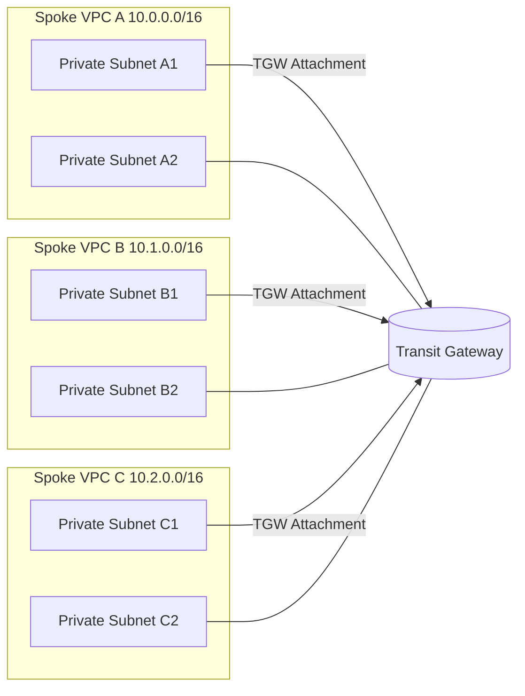

# Hub-and-Spoke
Let’s build a Basic Multi-VPC Hub-and-Spoke with AWS Transit Gateway using Terraform

# What you’ll deploy

- 1 Transit Gateway (TGW) with 1 TGW Route Table

- 3 Spoke VPCs (10.0.0.0/16, 10.1.0.0/16, 10.2.0.0/16), each with:

- 2 private subnets (across 2 AZs)
  
  - 1 TGW attachment (using those subnets)
  
  - A VPC route table that sends the other spokes’ CIDRs to the TGW

- (Optional) Tiny EC2 instances in each VPC for ping tests (security group allows ICMP among spokes)

# achitecture

